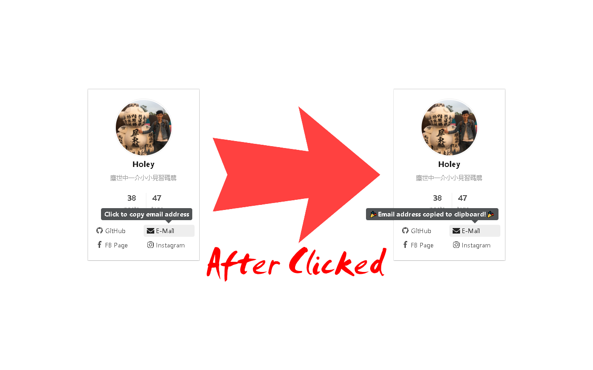

# No-MailTo

Stop websites from opening your mail client when clicking on email links.

## Introduction

Quickly copy email address from mailto links.

This handy extension will copy the mail address to clipboard from mailto link and stop to open default mail client application.

## Downloads

* [Google Chrome](https://chrome.google.com/webstore/detail/no-mailto/iddmkjnajdfempacejnkehobopmhekpm)
* [Microsoft Edge](https://microsoftedge.microsoft.com/addons/detail/no-mailto/kiikamekmkihjddgememaiinopmkdekf)